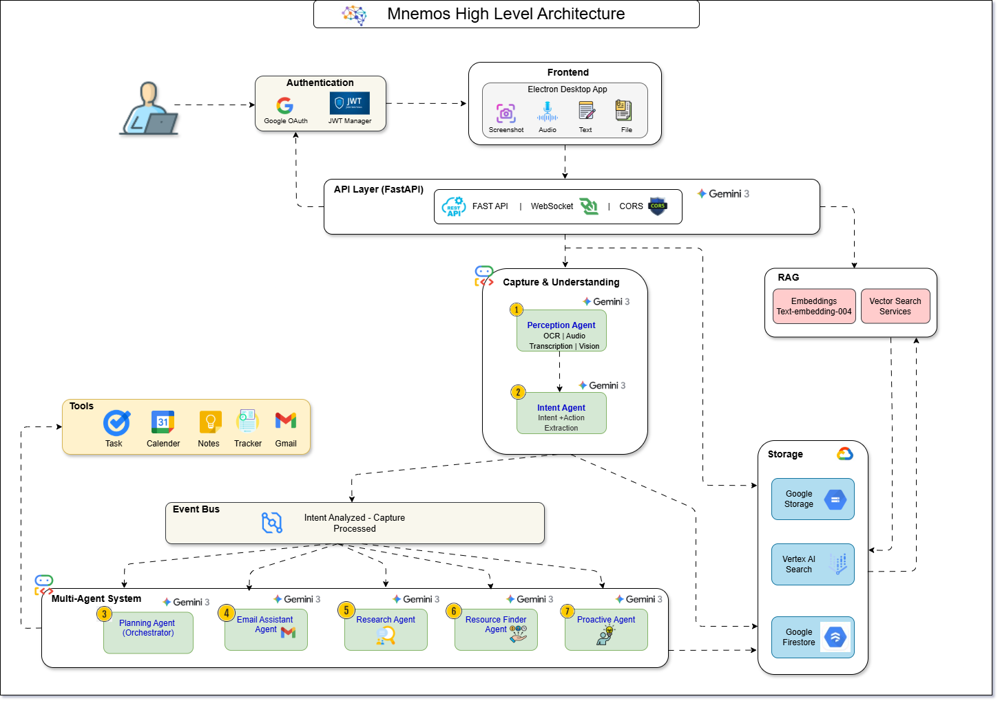
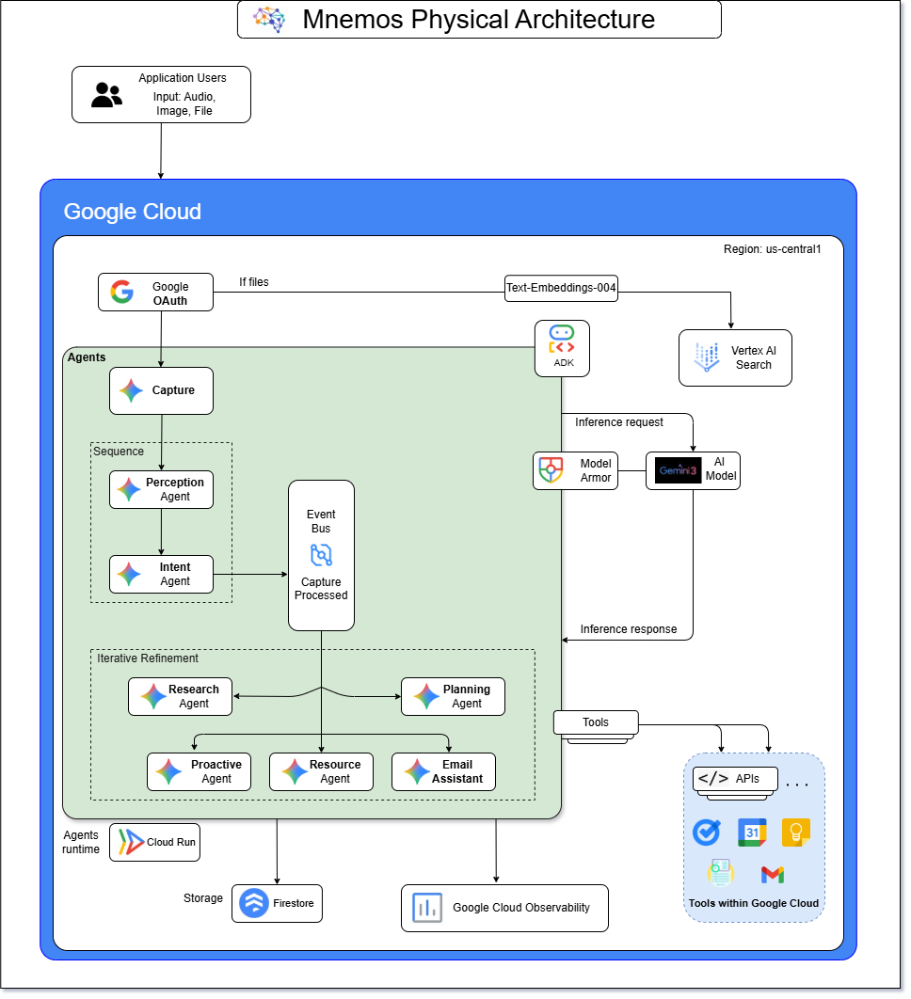

# Mnemos - Memory Meets Intelligence

**Hackathon Date:** 8 February 2026  
**Team Mnemos:** Sapna Chavan · Saurabh Chavan · Rohit Kosamkar

## Problem Statement
Modern knowledge work is defined by fragmented digital inputs screenshots, links, emails, PDFs, and voice notes captured with good intent but rarely revisited. The result is:

- **Information overload** across tools not designed to work together.
- **Lost intent** (“I’ll do this later”) due to context switching.
- **Manual follow-ups** for tasks, reminders, and research.

Mnemos addresses this gap by turning fleeting captures into **structured, actionable intelligence**—automatically.

## Solution Overview
Mnemos is a desktop “second brain” that captures information at the moment it appears, understands its **context and intent**, and **proactively executes actions** so users don’t have to.

With a single shortcut widget, users capture screenshots, audio, text, or files. Gemini 3 intelligence analyzes the capture, classifies it into life domains, extracts action items, and routes it through a multi‑agent system for research, reminders, and tool integrations (Calendar, Tasks, Gmail). Users return later to a curated, context‑aware knowledge base ready for action.

---

## High‑Level Architecture
Mnemos uses a modular, event‑driven, multi‑agent architecture that turns raw captures into structured intelligence and proactive execution.

### 1) User Authentication & Identity Management
- Google OAuth for sign‑in
- JWT-based session management
- Secure access to Google services (Calendar, Tasks, Gmail)

### 2) Frontend Layer (User Interaction)
- Electron desktop app
- Capture modes: **screenshot, audio, text, file upload**
- Shortcut‑first design to avoid workflow disruption

### 3) API Layer (Backend Gateway)
- FastAPI gateway for REST + WebSockets
- CORS management and request validation
- Low‑latency communication with Gemini 3 agents

### 4) Capture & Understanding (Gemini 3 Intelligence)
**Perception Agent**
- OCR from screenshots
- Audio transcription
- Visual context understanding

**Intent Agent**
- Classifies into 12 life domains
- Extracts 1–14 action items
- Identifies deadlines and priorities

### 5) Event Bus (Asynchronous Processing)
- Decoupled, event‑driven processing
- Parallel execution by multiple agents
- Scalable and extensible workflows

### 6) Multi‑Agent System (Execution & Orchestration)
- **Planning Agent** (orchestrator)
- **Email Assistant Agent**
- **Research Agent**
- **Resource Finder Agent**
- **Proactive Agent** (deadline monitoring)

### 7) Retrieval‑Augmented Generation (RAG)
- Text embeddings (**text‑embedding‑004**)
- Semantic vector search for recall and Q&A

### 8) Storage & Persistence
- **Google Cloud Storage** for files
- **Firestore** for structured metadata
- **Vertex AI Search** for semantic indexing

### 9) External Tool Integrations
- Google Calendar, Tasks, Notes, Gmail
- Automatic event/task creation and email drafting

---

## Physical Architecture (Deployment)
Mnemos is deployed on Google Cloud Platform with secure, serverless components for scale, reliability, and governance.

### Core Components
- **Compute:** Cloud Run (containerized, autoscaling services)
- **AI Inference:** Vertex AI (Gemini 3 + Model Armor)
- **Storage:** Firestore + Cloud Storage
- **Search:** Vertex AI Search (vector retrieval)
- **Security:** OAuth + IAM‑based service accounts
- **Observability:** Cloud Logging, Monitoring, Tracing

---

## System Flow (End‑to‑End)
1. User captures a screenshot, audio, text, or document.
2. Frontend sends payload to FastAPI gateway.
3. Perception Agent extracts text/transcripts and visual context.
4. Intent Agent classifies domain, identifies intent, and extracts actions.
5. Event Bus publishes structured events.
6. Multi‑agents perform research, drafting, task creation, and reminders.
7. RAG pipeline indexes data for semantic recall.
8. User retrieves knowledge or receives proactive notifications.

---

## Universal Classification Framework
Mnemos classifies data through a three‑layer model for consistency and scale.

### Layer 1: Life Domains (12)
Work & Career · Education & Learning · Money & Finance · Home & Daily Life · Health & Wellbeing · Family & Relationships · Travel & Movement · Shopping & Consumption · Entertainment & Leisure · Social & Community · Administration & Documents · Ideas & Thoughts

### Layer 2: Context Types (19)
Email · Chat Message · Document/PDF · Web Page · Application Screen · Form · Receipt/Invoice · Calendar Item · Social Media Post · Code/Terminal Output · Spreadsheet · Notification · Image · Audio Note · Video · Presentation · Task Item · Research Paper · Miscellaneous Content

### Layer 3: Intent Categories (14)
- **Action‑Oriented:** Act, Schedule, Pay, Buy
- **Information‑Oriented:** Remember, Learn, Track, Reference
- **Research‑Oriented:** Research, Compare
- **Follow‑Up:** Follow Up, Wait
- **Low Priority:** Archive, Ignore

---

## Tech Stack
### Backend
- **Language:** Python
- **Framework:** FastAPI
- **Libraries:** pydantic, uvicorn, httpx/requests
- **AI:** Google Generative AI SDK, Gemini 3 via Vertex AI
- **Async/Tasks:** asyncio, Celery

### Desktop Frontend
- **Framework:** Electron.js
- **UI:** HTML/CSS/JavaScript (React/Vue optional)
- **IPC:** Electron IPC + REST/WebSockets

### Data & Storage
- **Firestore** (structured metadata)
- **Google Cloud Storage** (files + media)
- **Vertex AI Search** (semantic retrieval)

### DevOps & Monitoring
- **Containers:** Docker
- **Deployment:** Cloud Run
- **Monitoring:** Google Cloud Logging & Monitoring
- **Testing:** Pytest, Jest/Mocha

---

## Impact & Results
Mnemos transforms “save for later” into **actionable outcomes**:

- **Reduces cognitive load** by handling capture + follow‑up automatically
- **Prevents missed deadlines** through proactive reminders
- **Improves recall** via semantic search across personal knowledge
- **Accelerates learning** by surfacing relevant resources instantly

---

## Accomplishments We’re Proud Of
- Built a **Gemini 3‑powered multi‑agent system** for proactive execution.
- Developed a **desktop-first capture experience** without disrupting workflow.
- Implemented a **RAG pipeline** for semantic search and intelligent recall.
- Integrated **Google Calendar, Tasks, and Gmail** with secure authentication.
- Delivered a **scalable, cloud‑native architecture** on Google Cloud.

---

## Roadmap (What’s Next)
- Expand integrations to more productivity tools.
- Add cross‑platform support including macOS native app.
- Introduce smarter prioritization and AI insights.
- Enable mobile and cross‑device synchronization.
- Enhance agent reasoning with advanced Gemini models.

---

## References
- Google Cloud SDK: https://docs.cloud.google.com/sdk/docs
- Host AI agents on Cloud Run: https://cloud.google.com/run/docs/ai-agents
- Multi‑agent systems on Google Cloud: https://cloud.google.com/architecture/multiagent-ai-system
- Gemini 3 on Vertex AI: https://docs.cloud.google.com/vertex-ai/generative-ai/docs/start/get-started-with-gemini-3
- Gemini API Overview: https://ai.google.dev/gemini-api/docs
- Google Gen AI Python SDK: https://googleapis.github.io/python-genai/
- Electron: https://www.electronjs.org/docs/latest
